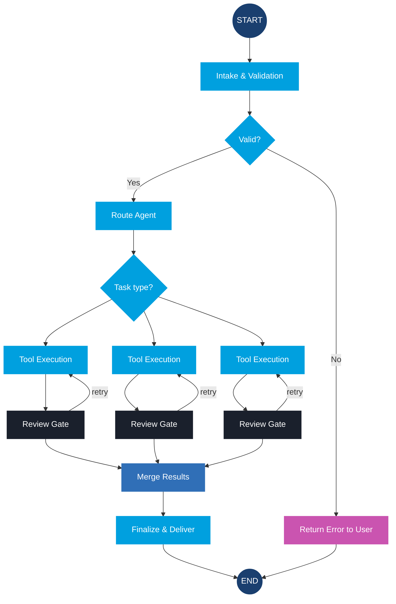

**Color overrides used in this diagram:**

| Node | Color | Why |
| :--- | :--- | :--- |
| START, END | Navy Dark `#1A3F6F` | Terminal — entry/exit, oval shape |
| Review Gate (×3) | Charcoal `#1A202C` | Human gate — must never look automated |
| Return Error to User | Pink `#CA54B0` | Error/rejection path |
| Merge Results | Navy `#306FB7` | Key CTA — single most important convergence |
| Everything else | Sky Blue `#00A0DF` | Default — no justification needed |
