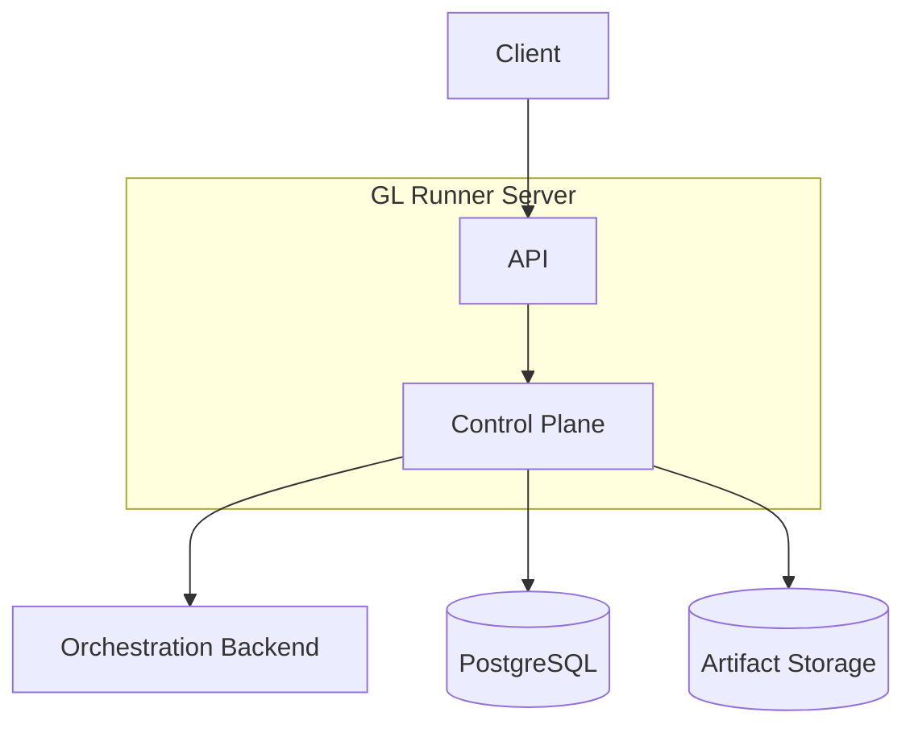
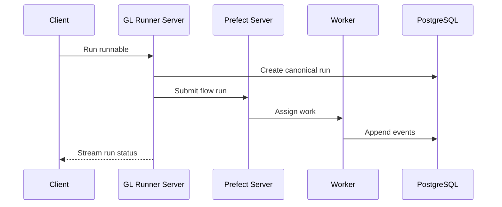

# Mermaid Diagram Presentability

Use this when:
- a doc has Mermaid diagrams that feel technically correct but visually messy
- architecture / roadmap / design docs need a shared visual grammar
- a repo has mixed Mermaid quality and you want one house style
- reviewers say diagrams are hard to scan, too noisy, or inconsistent

## Goals

1. Make the diagram readable in GitHub/GitLab markdown renderers first.
2. Keep one visual language across the repo.
3. Encode meaning with structure before color.
4. Use color sparingly and consistently.
5. Keep diagrams stable under editing — avoid layouts that fall apart after small changes.

## Global rules

### 1. Pick one semantic layer per diagram
Do not mix all of these in one figure unless the diagram is tiny:
- architecture boundaries
- runtime sequence
- data ownership
- rollout stages
- error paths

If a diagram tries to explain more than one question, split it.

### 2. Prefer short labels, move detail into bullets below
Good node text:
- `GL Runner Server`
- `Run History`
- `Schedule Sync`

Avoid paragraph nodes.
If you need detail, use one short label in the node and explain it in prose immediately after the diagram.

### 3. Keep a small set of canonical shapes
Default house style:
- service / component: `[Label]`
- storage / DB / object store: `[(Label)]`
- decision / gateway: `{Label}` only when a real branch exists
- grouped boundary: `subgraph`

Do not use every Mermaid shape just because it exists.

### 4. Encode meaning with position first
Recommended reading order:
- flowcharts: left→right for progression, top→bottom for stack/layers
- sequences: top→bottom by time, left→right by ownership boundary
- ERDs: parent/core entities on top-left, dependent tables below/right

If color is removed, the diagram should still make sense.

### 5. Cap line breaks inside nodes
Use at most 2 lines per node in most cases.
For example:
```mermaid
A[GL Runner Server<br/>Control Plane]
```
not 4-6 stacked bullets inside a node.

### 6. One color palette for the repo
Use 4 semantic color families max.
Recommended neutral palette:
- GL-owned / primary: fill `#E8F0FE`, stroke `#4F46E5`, text `#1F2A44`
- external / backend: fill `#F3F4F6`, stroke `#6B7280`, text `#111827`
- storage / persistence: fill `#ECFDF5`, stroke `#059669`, text `#064E3B`
- caution / deferred / future: fill `#FEF3C7`, stroke `#D97706`, text `#78350F`

Use red only for actual failure/error paths.

### 7. Keep class names semantic
Good:
- `classDef glOwned ...`
- `classDef backend ...`
- `classDef storage ...`
- `classDef deferred ...`

Avoid:
- `classDef blueBox ...`
- `classDef pretty1 ...`

### 8. Prefer explicit legends only when needed
Add a legend if the diagram uses:
- more than 3 classes
- mixed line types
- phase/status badges

If the meaning is obvious from headings and class names, skip the legend.

### 9. Use numbering only for ordered narratives
Good numbering use cases:
- rollout phases
- request lifecycle steps
- migration sequence
- decision trees

Do not number static architecture boxes unless the reader needs an execution order.

### 10. Optimize for markdown renderers
Avoid fragile tricks that render inconsistently:
- excessive emoji in nodes
- oversized HTML formatting
- deeply nested subgraphs
- too many crossing links
- long edge labels everywhere

## Per-diagram guidance

## Flowchart / architecture block diagrams

Best for:
- component boundaries
- system context
- processing pipelines
- roadmap progression

Preferred directions:
- `flowchart TB` for layer stacks
- `flowchart LR` for progression / lifecycle

Rules:
1. Put the product-owned boundary in a `subgraph`.
2. Put external systems outside it.
3. Put persistence at the bottom or far right.
4. Avoid bidirectional arrows unless both directions matter.
5. Label only important edges.

Good pattern:


Styling pattern:
```mermaid
classDef glOwned fill:#E8F0FE,stroke:#4F46E5,color:#1F2A44,stroke-width:1.5px;
classDef backend fill:#F3F4F6,stroke:#6B7280,color:#111827;
classDef storage fill:#ECFDF5,stroke:#059669,color:#064E3B;
class API,CTRL glOwned;
class ORCH backend;
class DB,OBJ storage;
```

Avoid:
- huge nodes with bullet lists
- diagonal spaghetti links
- mixing deployment topology and request order in one figure

## Sequence diagrams

Best for:
- request/response flow
- background execution lifecycle
- reconciliation loops
- sync/error handling

Rules:
1. Participants should be ownership-first, not implementation-detail-first.
2. Put client / caller first, GL-owned services next, external systems last.
3. Keep 5-8 participants max.
4. Use `Note over` for important rules instead of over-labeling messages.
5. Use `alt`, `opt`, and `loop` only for real branching logic.

Good participant order:
- User/Client
- API / GL Runner Server
- internal module / worker
- external backend
- storage

Message wording:
- use verbs: `Create run`, `Append event`, `Submit flow run`
- avoid sentence-length messages

Example:


Avoid:
- too many self-calls
- showing every DB read/write
- mixing conceptual steps and low-level implementation calls

## ER diagrams

Best for:
- canonical ownership model
- MVP schema overview
- table relationships

Rules:
1. Show only tables in the scope the doc claims.
2. If backend-native tables exist, mention them in prose unless they are truly part of the same canonical schema.
3. Keep only high-value columns in the ERD; put the full field table below.
4. Lead with primary entities first.

Recommended order:
- tenancy / identity tables
- canonical business entities
- execution/history tables
- extension tables

Column selection rule:
- include PK
- include major FKs
- include 2-4 fields that explain ownership or lifecycle
- omit boring bookkeeping unless it matters to the point

Avoid:
- dumping the full schema into the ERD
- mixing canonical tables with third-party internal tables unless the purpose is coexistence mapping

## Class diagrams

Best for:
- interfaces
- adapter contracts
- runtime abstractions

Rules:
1. Use class diagrams only for actual type/interface relationships.
2. Keep methods representative, not exhaustive.
3. Group by role: contract, implementation, consumer.
4. Show inheritance/composition sparingly.

Good rule of thumb:
- 3-7 classes per diagram
- 2-5 methods per class max

Avoid:
- turning the diagram into generated API docs
- listing every field and every method

## State diagrams

Best for:
- run lifecycle
- schedule reconciliation status
- approval / HITL status

Rules:
1. Keep states mutually exclusive.
2. Keep transition labels short and event-based.
3. Add terminal states explicitly.
4. Use composite states only if they simplify the story.

Good state names:
- `pending`
- `running`
- `completed`
- `failed`
- `cancelled`

Avoid:
- mixing state and action names
- encoding timestamps or metadata into state names

## Journey / roadmap diagrams

Best for:
- phase progression
- rollout sequencing
- capability maturity

Rules:
1. Use left→right progression.
2. Keep each stage label to 1 line plus optional short subtitle.
3. If using badges or icons, use them consistently.
4. Distinguish critical path vs optional tracks with line style or class, not color alone.

Recommended semantics:
- critical path: darker stroke / stronger fill
- parallel track: lighter fill or dashed linkage
- future / optional: caution color

Avoid:
- mixing roadmap and architecture boxes in the same figure
- too many phase-specific colors

## Numbering guidance

Use numbering only in these cases:
- ordered steps in a sequence-like flowchart
- phases in a roadmap
- migration or rollout sequence

Number style:
- use `① ② ③` in prose near the diagram, not necessarily inside every node
- if inside nodes, keep it short: `① Registry`, `② Run History`

Do not number:
- static ERD entities
- stable architecture components
- interface/class diagrams unless teaching order matters

## Label style guide

### Node labels
- Title Case for components: `GL Runner Server`
- sentence fragments for capabilities: `Run History`
- no trailing punctuation

### Edge labels
- verb-first and short
- examples:
  - `submits`
  - `stores`
  - `streams`
  - `reconciles`

### Section titles above diagrams
Use a title that answers a question:
- `Canonical Background Execution Flow`
- `GL-Owned Schema Overview`
- `Operational Footprint Progression`

Not:
- `Diagram 1`
- `Architecture Figure`

## Color and style defaults

Use this reusable block when Mermaid init is supported:
```mermaid
%%{init: {
  "theme": "base",
  "themeVariables": {
    "fontFamily": "Inter, ui-sans-serif, system-ui, sans-serif",
    "fontSize": "14px",
    "primaryColor": "#E8F0FE",
    "primaryTextColor": "#1F2A44",
    "primaryBorderColor": "#4F46E5",
    "lineColor": "#475569",
    "secondaryColor": "#F3F4F6",
    "tertiaryColor": "#ECFDF5"
  }
}}%%
```

If init blocks are not supported by the target renderer, use `classDef` styling only.

Recommended line styles:
- default solid arrow = primary path
- dashed arrow = optional/inferred/deferred relationship
- thick stroke = critical path only when necessary

## Repo-level consistency checklist

Before finalizing Mermaid in a repo, check:
- [ ] same terms across all diagrams (`Server`, `Worker`, `Orchestrator`, etc.)
- [ ] same direction conventions (`TB` for stacks, `LR` for progression)
- [ ] same 3-4 semantic classes reused
- [ ] same naming rule for stages (`GL0`, `GL1`, etc.)
- [ ] no diagram duplicates the same story with slightly different labels

## Practical beautification workflow

A copy-paste template pack is available in `references/examples.md` for:
- architecture/system context flowcharts
- lifecycle sequence diagrams
- GL-owned ERDs
- roadmap progression diagrams
- interface/class diagrams
- state diagrams

1. Identify the one question the diagram must answer.
2. Delete any node/edge that does not help answer that question.
3. Reorder nodes for natural reading direction.
4. Shorten node labels.
5. Group boundaries with `subgraph`.
6. Apply semantic classes.
7. Add a legend only if meaning is not obvious.
8. Move detail into bullets under the diagram.
9. Re-check for crossing edges and duplicated concepts.

## When Mermaid is the wrong tool

Use Mermaid when the diagram needs to stay editable in source and the layout is still readable after cleanup.

Switch to a rendered asset when the figure is mostly a static block diagram with:
- 0 to very few arrows
- large nested boundaries
- strict stacked composition
- repeated layout fights in Mermaid

Recommended fallback:
1. Draw the block diagram in Graphviz DOT or another SVG-first tool.
2. Render to SVG and PNG.
3. Keep the source `.dot` or `.svg` next to the markdown.
4. In Google Docs, insert the rendered PNG with the Google Docs image workflow instead of trying to force Mermaid to do the stacking.

This is especially useful for high-level ecosystem diagrams and “authoritative boundary” views where visual grouping matters more than live Mermaid editing.

For architecture-family docs, a useful split is:
- ecosystem / context view: one stacked dependency diagram
- internal boundary view: one nested subsystem diagram
- runtime detail: separate sequence diagrams

Keep cross-cutting capabilities like observability in prose or a dedicated callout unless they are truly part of the dependency ladder being shown.
split is:
- ecosystem / context view: one stacked dependency diagram
- internal boundary view: one nested subsystem diagram
- runtime detail: separate sequence diagrams

Keep cross-cutting capabilities like observability in prose or a dedicated callout unless they are truly part of the dependency ladder being shown.

Practical lesson from use:
- if the diagram is mostly a stacked block composition with very few arrows, Graphviz/DOT is often the better medium than Mermaid
- keep the source `.dot` alongside the markdown and publish the rendered PNG/SVG into Google Docs instead of forcing Mermaid to carry the visual layout
- this worked well for ecosystem overviews and architecture boundary views that needed nested boxes, consistent widths, and minimal line crossings
- for GL Runner docs specifically, split the visuals by question: use one ecosystem / dependency-stack figure for the broad platform relationship, and a separate internal boundary figure for `GL Runner Server` and `GL Runner Worker`
- keep cross-cutting concerns like `GL Observability` in prose or a side note unless the figure is explicitly about telemetry; do not let them distort a dependency ladder
- when a stacked block figure feels visually noisy, tune widths and alignment in DOT rather than adding more Mermaid edges, because the layout fight usually means the tool choice is wrong

- this worked well for ecosystem overviews and architecture boundary views that needed nested boxes, consistent widths, and minimal line crossings

## Good defaults by doc type

### Architecture docs
- 1 context/block diagram
- 1 execution/runtime sequence
- 1 deployment/footprint progression

### Design docs
- 1 contract/class diagram
- 1 canonical lifecycle sequence
- 1 ERD if data ownership matters

### Roadmaps/specs
- 1 phase/stage progression flowchart
- optional dependency graph
- avoid full architecture redraw here unless needed

## Mermaid rendering pitfalls

These cause `< Invalid Mermaid Codes >` or blank renders in GitHub, GitLab, and common markdown viewers:

- **`\n` in labels** -- never use `\n` or `\\n` inside `[ ]` node text. Use a separate reference node instead (e.g. `S3_ref[S3 - Run History]`).
- **`<br/>` and `<small>` HTML in labels** -- many renderers do not support HTML inside node text. Use plain text only.
- **Unicode box-drawing or em-dash chars** (`—`, `–`, `━`, `┃`, `╲`, `╱`) in `subgraph` titles -- use plain ASCII hyphens (`-`) instead.
- **`direction LR/TB` inside subgraphs** -- older mermaid versions (GitHub's bundled version) silently reject this, producing blank subgraphs or parse errors.
- **`stroke-dasharray` in classDef** -- not valid class syntax in some mermaid versions; use it in shape properties or skip it.
- **Transparent classDef fill** -- `fill:transparent` causes invisible elements that still capture clicks and confuse the layout engine. Use explicit light background colors instead.

## Splitting large roadmaps

A single mermaid graph with 8+ stages, 15+ nodes, and cross-phase edges will overflow or become unreadable. Split into phase diagrams instead:

- **Phase 1 (MVP/Foundation):** GL0 and GL1 only. Shows bootstrap to first working product.
- **Phase 2 (Enhancement):** GL2a and GL2b side-by-side, merging into GL3. Shows parallel tracks.
- **Phase 3 (Production):** GL4 through GL7 in a vertical chain. Shows linear hardening.
- **Reference nodes:** Use gray-styled reference nodes (e.g. `S3_ref[S3 - Run History]`) to show continuity from a previous phase without duplicating the full upstream graph.
- **Max 5-8 nodes per diagram**, 2-4 subgraphs max.

## Color semantics for phases

Use a consistent color family per phase so readers can identify where they are at a glance:

| Phase | Color | Hex | Meaning |
|-------|-------|-----|---------|
| Foundation/MVP | Blue | `#E8F0FE`, `#DBEAFE` | Infrastructure, setup, platform base |
| Enhancement/Integration | Amber | `#FEF3C7` | Extended capability, SDK, orchestration |
| Execution/Workers | Green | `#D1FAE5` | Active processing, background jobs |
| HITL/Human interaction | Pink | `#FCE7F3` | Human approval, suspend/resume |
| Tools/Ecosystem | Orange | `#FED7AA` | Extensions, composition |
| Hardening/Observability | Soft red | `#FFE4E6` | Production concerns, monitoring |
| Scale/Enterprise | Purple | `#F3E8FF` | Advanced deployment, autoscaling |

## Anti-patterns

Do not do these:
- 10+ nodes all with unique colors
- every node full of bullets
- both actor/system flow and schema in one diagram
- duplicated diagrams with different wording in different files
- GL-owned and third-party-owned tables mixed into one ERD without clear ownership note
- decorative numbering that implies order where none exists

## GitHub / GitLab Renderer Compatibility

GitHub and GitLab use older or restricted Mermaid versions. Several modern Mermaid features work locally but produce `< Invalid Mermaid Codes >` or blank renders in pull requests:

1. **No `%%{init:{...}}%%` blocks** -- JSON config blocks are unsupported. Use `classDef` styling only.
2. **No `direction LR/TB` inside subgraphs** -- Remove `direction` declarations from subgraph bodies. GitHub's parser rejects them.
3. **No CSS properties in `classDef`** -- Properties like `stroke-dasharray` cause parse errors. Stick to `fill`, `stroke`, `stroke-width`, `color`, `text-align`, `padding`, `rx`, `ry`.
4. **Avoid deeply nested subgraphs** -- More than 2 levels deep often breaks layout or renders off-screen.
5. **Keep edge labels short** -- Long labels cause node overlap and arrow collisions.

If a diagram fails to render in a PR, strip `%%{init...}` and `direction` first -- that fixes >80% of cases.

### No Literal `\n` in Node Labels

Labels like `[P5 - Run Lifecycle\nfrom GL3]` break restricted Mermaid renderers (GitHub, GitLab). The `\n` escape is not recognized and produces `< Invalid Mermaid Codes >`. Use a separate "from previous phase" node instead:

```mermaid
P5_ref[P5 - Run Lifecycle]
```

Then explain the phase origin in the prose heading above the diagram.

### No Unicode Box-Drawing or Em-Dash in Labels

The `─` (U+2500, box-drawing horizontal) and `—` (U+2014, em-dash) characters in subgraph titles or node labels cause silent rendering failures on restricted renderers. Always use plain ASCII `-` instead:

```
GOOD:  GL0[GL0 - Foundation]
BAD:   GL0[GL0 ─ Foundation]     (box-drawing)
BAD:   GL0[GL0 — Foundation]     (em-dash)
```

This applies to `subgraph` titles and node text content equally.

### Inline Arrow Node Pitfall

Using inline definition + arrow in one line -- `CLI[CLI / curl] --> E1` -- creates a node that the layout engine places independently from any wrapping subgraph. This causes orphan/duplicate nodes in the rendered output. Either define the node separately before the arrow, or avoid the wrapper subgraph entirely.

### Section Header Nodes Don't Work

Adding fake section headers like `GL0["◆ GL0 — Foundation"]` as floating nodes (connected to nothing, or connected with arrows to everything) just adds more nodes to the graph. They render as regular boxes competing with content nodes. Mermaid has no concept of section headers. Use prose headings between diagrams instead, or a single clean diagram without header nodes.

### Phase-Break Diagrams Over Monoliths

When a roadmap has many stages (GL0 through GL7 = 8 stages, 20+ nodes), a single diagram that tries to show everything becomes illegible. Split into phase-based diagrams instead:

- **Phase 1 (MVP)**: GL0 + GL1 only -- foundation and core execution
- **Phase 2 (Enhancement)**: GL2a + GL2b + GL3 -- SDK, orchestration, background workers
- **Phase 3 (Scale)**: GL4 through GL7 -- HITL, tools, observability, hardening

Each diagram gets 2-4 subgraphs with 5-8 nodes max. Use faded "from previous phase" nodes (gray classDef) at the top of Phase 2+ diagrams to show the handoff point. This is far more scannable than a 20-node single graph.

When replacing a messy diagram, resist the urge to split into 5 focused views immediately. Start with one clean left-to-right dependency graph or top-down architecture diagram. If it renders and communicates the core story, it's usually enough. Add a second diagram only if the first one genuinely cannot answer a different question for the reader.

When a project's branch introduces spec refinements (e.g., GL0 splitting S1 into S1a/S1b/S1c with their own `spec.md` files), diagrams must be completely rebuilt -- not patched node-by-node. The replacement checklist:

1. **Check for new spec directories** before editing diagrams: `find specs/ -name "spec.md" -type f | sort`
2. **Extract dependencies from each spec file** -- look for dependency tables inside each `spec.md`
3. **Trace the full chain** -- if S1 was split into S1a->S1b->S1c, the dependency chain changes from `F0->S1->S2` to `D1->M1->S1a->S1b->S1c->S2`
4. **Verify against the source-of-truth PR** -- if PR #X introduced the spec changes, pull that branch (`git fetch origin pull/X/head:prX-temp`) and compare the ROADMAP.md diagrams there before writing new ones
5. **Do not patch; rewrite** -- changing 2-3 node names is usually insufficient because the dependency topology itself has changed

## Phase Dependency Diagram Correctness

When building phase-based mermaid diagrams for a project roadmap, always cross-reference every arrow against the canonical dependency table (often called "Execution Sequence" or "Stage Ordering Rules"):

1. **Extract the dependency table** from ROADMAP.md -- find the section listing each sequence ID with its "Depends on" column.
2. **Validate every diagram arrow** -- for each node in the mermaid block, confirm every incoming arrow has a matching row in the dependency table. No invented dependencies.
3. **Never invent intermediate nodes** -- do not create fake nodes like "M1: DB Models + Auth" to serve as convergence points. If the table says S1 depends on F0 and S3 depends on S1, S2, draw S1 --> S3 directly.
4. **Parallel items from same deps stay parallel** -- if P1 depends on S1,S3 and P2 depends on S1,S3, draw S1-->P1, S3-->P1, S1-->P2, S3-->P2. Do not chain P2-->P1 or P1-->P2.
5. **Phase handoff via gray reference nodes** -- when Phase 2 depends on items from Phase 1 (e.g., E1 depends on S2,S3,S4,S5), do not duplicate the full Phase 1 diagram. Instead use gray reference nodes: `S3_ref[S3 - Run History]` with a gray classDef (`fill:#F3F4F6,stroke:#9CA3AF`).

### Common Phase 1 Pattern (GL0/GL1)

```
Phase 1 typical dependency shape (from GL Runner Execution Sequence):
  F0 --> S1    [S1 depends on F0]
  F0 --> S2    [S2 depends on F0]
  S1 --> S2    [S2 depends on S1]
  S1 --> S3    [S3 depends on S1]
  S2 --> S3    [S3 depends on S2]
  S1 --> S4    [S4 depends on S1]
  S2 --> S5    [S5 depends on S2]
```

Note: S3 depends on BOTH S1 and S2 -- draw both. S2 depends on BOTH F0 and S1 -- draw both. Do not collapse to a single linear chain.

### Stray Backticks Can Wrap Content As Code

When inserting diagrams alongside markdown tables, text, or other content, always verify that no extra ```` ``` ```` tokens accidentally wrap adjacent content. A common failure mode:

```markdown

**Key:** ...

```                          <-- STRAY: wraps everything below as code

| Phase | Items |
```

The stray triple-backtick after the key line causes the entire dependency table to render as a raw code block instead of a formatted markdown table. Always verify the rendered output, not just the source.

## Cross-Doc Terminology Alignment Checklist

When improving diagrams for an existing PR or repo, verify before committing:

- [ ] **Node labels match source specs** -- use the actual identifiers (F0, S1, E2...) from ROADMAP.md or equivalent, not made-up shorthand (D1, D2, S1a...)
- [ ] **All documented stages are present** -- if the roadmap has GL0–GL7, stopping at GL3 makes the diagram incomplete and misleading
- [ ] **Component placement matches architecture.md** -- standalone services go outside worker boundaries, data stores are at the bottom
- [ ] **Terminology matches design.md** -- pluggable interfaces, contract names, and component labels should be consistent across docs
- [ ] **Review report findings addressed** -- if an existing code review flagged terminology inconsistencies (e.g., "Executor" meaning two things), the new diagram should use the corrected terminology
- [ ] **Search all docs for inconsistent terms** -- grep for old/wrong terminology across every markdown file in the branch (e.g., `grep -rn 'Orchestration Server' docs/ specs/`). Diagrams often use the right term while surrounding prose still uses the old one. Common patterns caught:
  - "Orchestration Server" vs "Orchestration Backend" -- one is a separate service, one is an internal module
  - "Executor" used for both orchestration backend and worker runtime primitive
  - "talks to the X server via HTTP" when X is actually an internal module
- [ ] **Diagram component classes match actual ownership** -- if a component (e.g., Orchestration Backend) is documented as part of the GL-owned stack, it should share the blue/green styling, not be styled gray as if it were external

## Practical findings from use

- When beautifying a repo-wide Mermaid set, start with architecture, roadmap, implementation, and lifecycle sequence diagrams first. They benefit the most from presentability cleanup and usually have the most visible inconsistency.
- Compact ERDs often need less styling than flowcharts/sequences. If an ERD is already structurally clean, leave it stable unless the user explicitly wants a redraw into a stricter house style.
- For roadmap diagrams, remove status/emoji clutter from node labels and move status meaning into class styling or the surrounding table. Shorter stage labels render better and are easier to scan.
- For sequence diagrams, normalize participant aliases (`C`, `S`, `D`, `P`, `W`) and use concise verb-first messages. This usually improves readability more than adding visual styling.
- For architecture overviews with long cross-boundary arrows, split the figure into a boundary view plus one narrower server/worker handoff view rather than forcing a single crowded graph.
- For state diagrams, keep retry semantics out of the state machine when they create visual loops; explain retry behavior in prose and preserve a clean terminal-state graph.
- For deployment/materialization flows, use short labels and a simple left-to-right chain. If the diagram depends on line breaks inside nodes, it is usually a sign the labels should be shortened.
- After patching Mermaid-heavy markdown files, re-run a local markdown link/anchor check. Diagram edits often happen near headings and fenced blocks, and it is easy to leave behind malformed fences or broken nearby references.
- Before publishing Mermaid-heavy docs to Google Docs, render every Mermaid block locally with `mermaid-cli` and confirm the images are valid. This catches layout failures earlier and makes the later Docs image insertion step much more predictable.
- When doing bulk diagram rewrites, review the rendered markdown around each edited block for accidental leftover lines after closing fences. A common failure mode is leaving stale lines from the previous diagram body below the new fenced block.

## When adapting an existing diagram set

If a repo already has some strong diagrams:
- preserve the existing semantic meanings if they are internally consistent
- migrate weaker diagrams toward the same palette and direction rules
- do not restyle one diagram in isolation if it makes the whole repo feel mixed

For GL-style docs, a good house style is:
- layer-first architecture blocks
- concise sequence diagrams for lifecycle
- GL-owned-only ERDs
- roadmap progression kept visually separate from system topology

**GitHub Roadmap Mermaid Rendering Checklist:**

- [ ] No `%%{init{...}}%%` blocks -- GitHub doesn't support them
- [ ] No `direction LR/TB` inside subgraphs -- silently fails
- [ ] No `\n` escapes in labels -- use separate reference nodes instead
- [ ] No `<br/>` or `<small>` HTML in node text
- [ ] No Unicode box-drawing or em-dash chars (`—`, `–`, `━`, `╲`) -- use plain ASCII `-`
- [ ] No `stroke-dasharray` in classDef -- not valid in older versions
- [ ] No transparent fill classDef -- causes invisible click-capturing elements
- [ ] Keep diagrams under 15 nodes for readability
- [ ] Test by viewing the actual rendered PR, not just previewing the markdown
