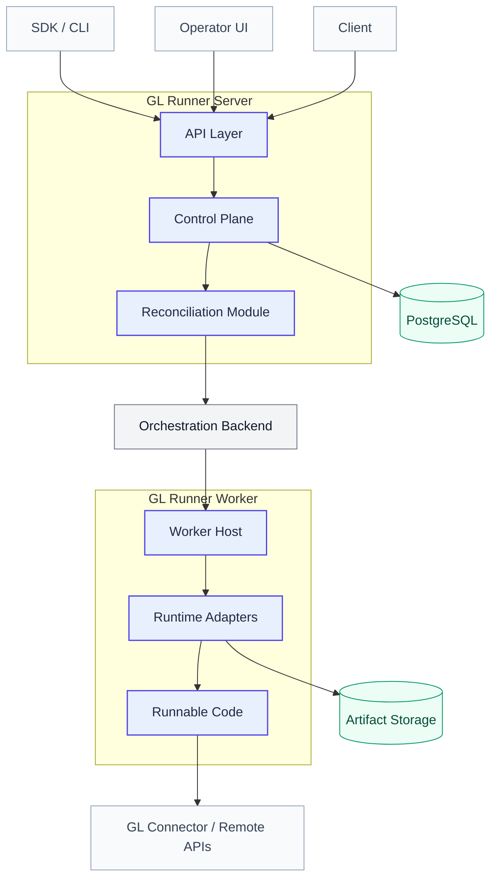
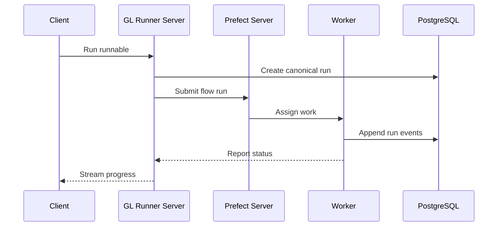
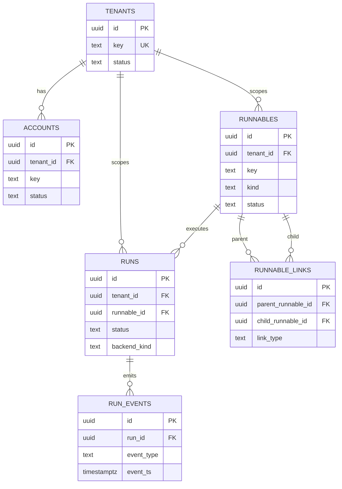
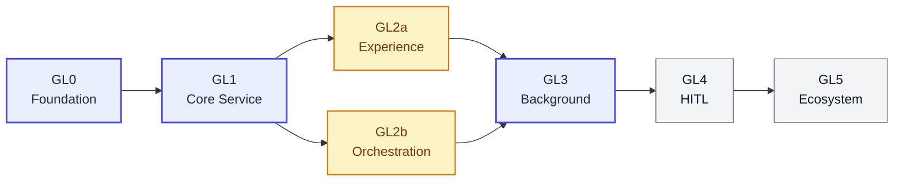
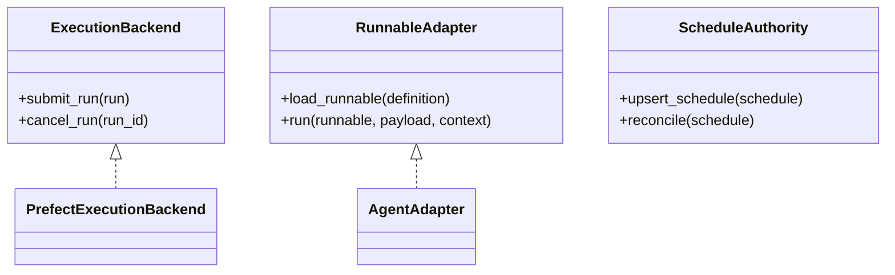
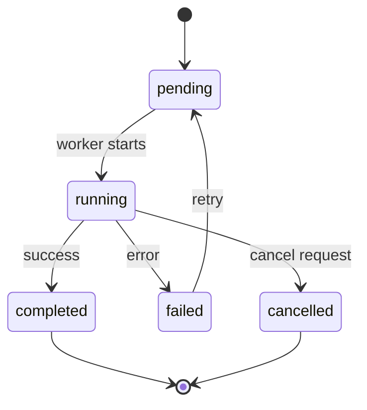

# Mermaid Presentability Examples

These are copy-paste templates meant for repo docs, specs, and roadmaps.

## 1. Architecture / system context flowchart

## 2. Lifecycle / background execution sequence

## 3. GL-owned ERD

## 4. Roadmap / phase progression

## 5. Interface / abstraction class diagram

## 6. State diagram

